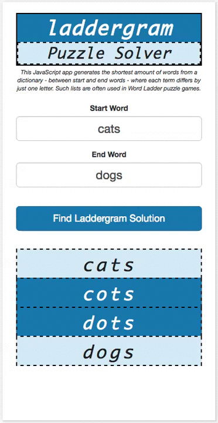

#Laddergram Word Puzzle Solver

Laddergram Puzzle Solver is a utility app written in JavaScript that generates the shortest amount of words from a dictionary - between start and end words - where each term differs by just one letter. Such lists are often used in Word Ladder puzzle games.

The JavaScript code makes use of linked lists and Queue data structures to efficiently process the dictionary results. It's funny to see the app grind away when long word ladders are generated - see screengrab below :-)

Working demo here: http://lewhunt.github.io/laddergram-puzzle-solver

## Example
Screengrab below showing app in use

