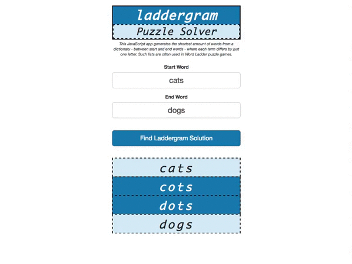

#Laddergram Word Puzzle Solver

Laddergram Puzzle Solver is a JavaScript app that generates the shortest amount of words from a dictionary - between start and end words - where each term differs by just one letter. Such lists are often used in Word Ladder puzzle games.

View demo here: http://lewhunt.github.io/laddergram-puzzle-solver

## Example
Screengrab showing app in use

